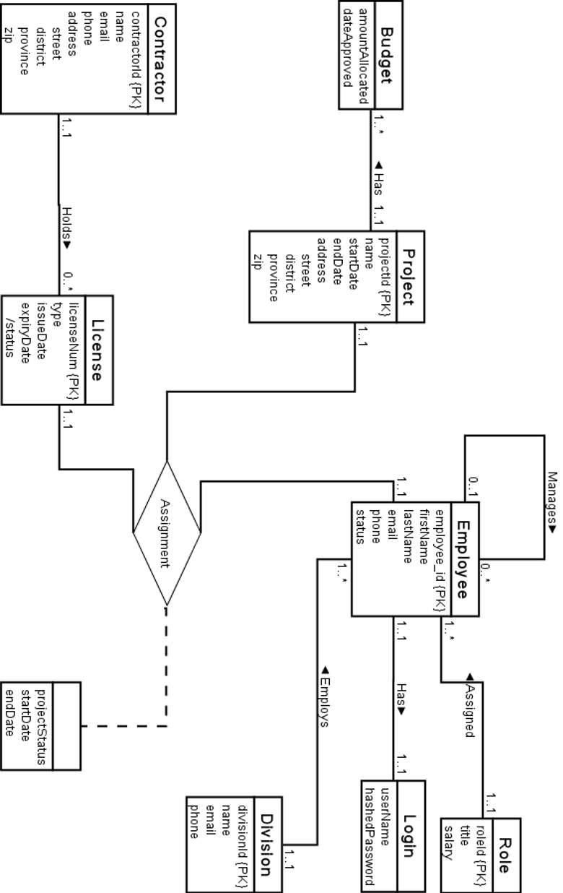

# DepartmentDatabase

Database requirement analysis, entity-relationship model design, relational schema design, normalization, data dictionary documentation, procedures&amp;query creation and application code design for sample government office.

Okay, here are the Entity Relationship Diagram and Data Dictionary sections from the project report.

## ENTITY RELATIONSHIP MODEL

The project report includes an Entity Relationship Model diagram. This diagram visually represents the database entities, their attributes, and the relationships between them.

## DATA DICTIONARY

The Data Dictionary details the structure of each table in the database.

### Division

Stores department division details.

| Attribute Name | Description                 | Datatype      | Domain                 | Nullable | PK  | FK  |
| :------------- | :-------------------------- | :------------ | :--------------------- | :------- | :-- | :-- |
| divisionId     | Unique ID for each division | Char (4)      | 0000-999               | No       | Yes | No  |
| name           | Name of the division        | Varchar2(50)  | All                    | No       | No  | No  |
| email          | Division email address      | Varchar2(100) | Valid email format     | No       | No  | No  |
| phone          | Division contact number     | Char (10)     | 1111111111- 9999999999 | Yes      | No  | No  |

### Employee

Records employee information.

| Attribute Name | Description                        | Datatype      | Domain                                                           | Nullable | PK  | FK  |
| :------------- | :--------------------------------- | :------------ | :--------------------------------------------------------------- | :------- | :-- | :-- |
| employeeId     | Unique ID for each employee        | Char (5)      | Alphanumeric                                                     | No       | Yes | No  |
| firstName      | Employee's first name              | Varchar2(50)  | All                                                              | No       | No  | No  |
| lastName       | Employee's last name               | Varchar2(50)  | All                                                              | No       | No  | No  |
| email          | Employee email                     | Varchar2(100) | Valid email format                                               | No       | No  | No  |
| phone          | Employee phone number              | Char (10)     | 1111111111- 9999999999                                           | Yes      | No  | No  |
| division       | Division to which employee belongs | Char (4)      | 0000-9999                                                        | No       | No  | Yes |
| role           | Role of the employee               | Char (4)      | Alphanumeric                                                     | No       | No  | Yes |
| manager        | Manager above employee             | Char (5)      | Alphanumeric                                                     | Yes      | No  | Yes |
| status         | Status of the employee             | Varchar2(15)  | Fixed set {active, left, retired, terminated}. Default ‘active’. | No       | No  | No  |

### Login

Manages user credentials.

| Attribute Name | Description                        | Datatype       | Domain         | Nullable | PK  | FK  |
| :------------- | :--------------------------------- | :------------- | :------------- | :------- | :-- | :-- |
| employee       | employeeId from the employee table | Char (5)       | Alphanumeric   | No       | Yes | Yes |
| userName       | Login username                     | Varchar2(25)   | All and Unique | No       | No  | No  |
| hashedPassword | Password in hashed format          | Varchar2 (256) | All            | No       | No  | No  |

### Role

Defines job roles and salaries.

| Attribute Name | Description                 | Datatype     | Domain            | Nullable | PK  | FK  |
| :------------- | :-------------------------- | :----------- | :---------------- | :------- | :-- | :-- |
| roleId         | Unique role identifier      | Char (4)     | Alphanumeric      | No       | Yes | No  |
| title          | Title of the role           | Varchar2(50) | All               | No       | No  | No  |
| salary         | Salary assigned to the role | Number       | Between 3k to 50k | No       | No  | No  |

### Project

Stores project-related details.

| Attribute Name | Description           | Datatype      | Domain       | Nullable | PK  | FK  |
| :------------- | :-------------------- | :------------ | :----------- | :------- | :-- | :-- |
| projectId      | Unique ID for project | Char (10)     | Alphanumeric | No       | Yes | No  |
| name           | Project name          | Varchar2(100) | All          | No       | No  | No  |
| startDate      | Start date            | Date          | > 2000-01-01 | No       | No  | No  |
| endDate        | End date              | Date          | >startDate   | Yes      | No  | No  |
| street         | Street address        | Varchar2(100) | All          | No       | No  | No  |
| district       | District name         | Varchar2(15)  | All          | No       | No  | No  |
| province       | Province name         | Varchar2(15)  | All          | No       | No  | No  |
| zip            | Postal code           | Char (5)      | 11111-99999  | No       | No  | No  |

### Budget

Budget allocated to projects.

| Attribute Name  | Description                                     | Datatype  | Domain        | Nullable | PK  | FK  |
| :-------------- | :---------------------------------------------- | :-------- | :------------ | :------- | :-- | :-- |
| budgetId        | Unique budget ID                                | Char (10) | Alphanumeric  | No       | Yes | No  |
| Project         | Id of the project for which budget is allocated | Char (10) | Alphanumeric  | No       | No  | Yes |
| amountAllocated | Total allocated amount                          | Number    | "> 1,000,000" | No       | No  | No  |
| dateApproved    | Date of approval                                | Date      | >2000-01-01   | No       | No  | No  |

### Contractor

Information about external contractors.

| Attribute Name | Description               | Datatype      | Domain                                                              | Nullable | PK  | FK  |
| :------------- | :------------------------ | :------------ | :------------------------------------------------------------------ | :------- | :-- | :-- |
| contractorId   | Unique contractor ID      | Char (10)     | Alphanumeric                                                        | No       | Yes | No  |
| name           | Contractor's company name | Varchar2(100) | All                                                                 | No       | No  | No  |
| email          | Contact email, unique     | Varchar2(100) | Valid email format                                                  | No       | No  | No  |
| phone          | Contact phone, unique     | Char (10)     | 1111111111- 9999999999                                              | No       | No  | No  |
| street         | Street address            | Varchar2(100) | All                                                                 | No       | No  | No  |
| district       | District name             | Varchar2(15)  | All                                                                 | No       | No  | No  |
| province       | Province name             | Varchar2(15)  | All                                                                 | No       | No  | No  |
| zip            | Postal code               | Char (5)      | 11111-99999                                                         | No       | No  | No  |
| status         | Status of the employee    | Varchar2(15)  | Fixed set {active, left, suspended, blacklisted}. Default ‘active’. | No       | No  | No  |

### License

Records contractor licenses.

| Attribute Name | Description                             | Datatype  | Domain       | Nullable | PK  | FK  |
| :------------- | :-------------------------------------- | :-------- | :----------- | :------- | :-- | :-- |
| licenseNum     | Unique license number                   | Char (10) | Alphanumeric | No       | Yes | No  |
| contractorId   | Id of contractor to whom license issued | Char (10) | Alphanumeric | No       | No  | Yes |
| issueDate      | License issue date                      | Date      | >2000-01-01  | No       | No  | No  |
| expiryDate     | License expiration date                 | Date      | >issueDate   | No       | No  | No  |

### Assignment

Tracks who are assigned to which project with which license and supervisor, and the status of the project at that instance.

| Attribute Name | Description                           | Datatype     | Domain                                                  | Nullable | PK  | FK  |
| :------------- | :------------------------------------ | :----------- | :------------------------------------------------------ | :------- | :-- | :-- |
| project        | Id of the project                     | Char (10)    | Alphanumeric                                            | No       | Yes | Yes |
| projectStatus  | Status of the project                 | Varchar2(15) | Fixed set {planning, procurement, building, completing} | No       | Yes | No  |
| license        | License Number of the project handler | Char (10)    | Alphanumeric                                            | No       | Yes | Yes |
| employee       | Id of supervising employee            | Char (5)     | Alphanumeric                                            | No       | Yes | Yes |
| startDate      | Assignment start date                 | Date         | > 2000-01-01                                            | No       | No  | No  |
| endDate        | Assignment end date                   | Date         | > startDate                                             | Yes      | No  | No  |
